# NyayaSahay (LexAI): Indian Legal Assistance System

## Project Documentation

**Version:** 1.0  
**Date:** September 2026  
**Platform:** Web Application (Desktop & Mobile Responsive)

---

## Table of Contents

1. [Design Stage (System Architecture and UML Diagrams)](#1-design-stage-system-architecture-and-uml-diagrams)
2. [Data Collection](#2-data-collection)
3. [Implementation on User Interface](#3-implementation-on-user-interface)
4. [Code Implementation](#4-code-implementation)

---

## 1. Design Stage (System Architecture and UML Diagrams)

The NyayaSahay platform follows a modern, decoupled client–server architecture. A **React / TanStack Start** frontend communicates with a **Python FastAPI** backend over REST and SSE (Server-Sent Events). The backend employs a **Tiered Hybrid Retrieval-Augmented Generation (RAG)** strategy — local-first for privacy and speed, with intelligent fallback to external legal sources.

### 1.1 High-Level System Architecture

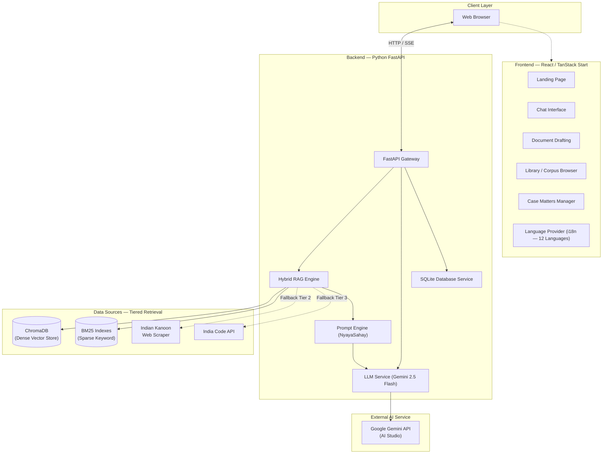

### 1.2 Tiered Retrieval Pipeline Architecture

The retrieval system uses a confidence-gated tiered fallback approach to guarantee factual, grounded responses while eliminating hallucination.

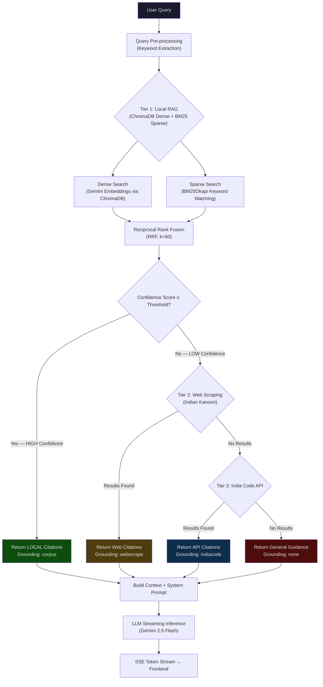

### 1.3 UML Sequence Diagram — Chat Query Lifecycle

This sequence diagram illustrates the complete end-to-end lifecycle of a user submitting a legal query and receiving a streamed, citation-grounded response.

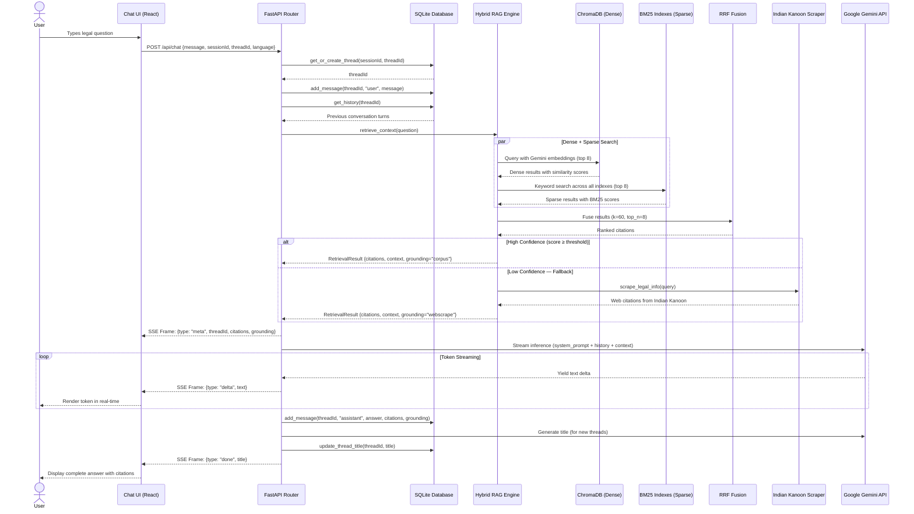

### 1.4 UML Class Diagram — Backend Data Models

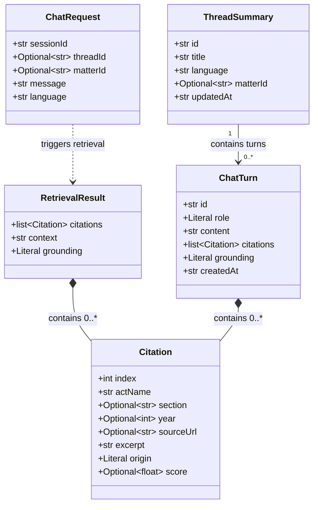

### 1.5 Deployment Diagram

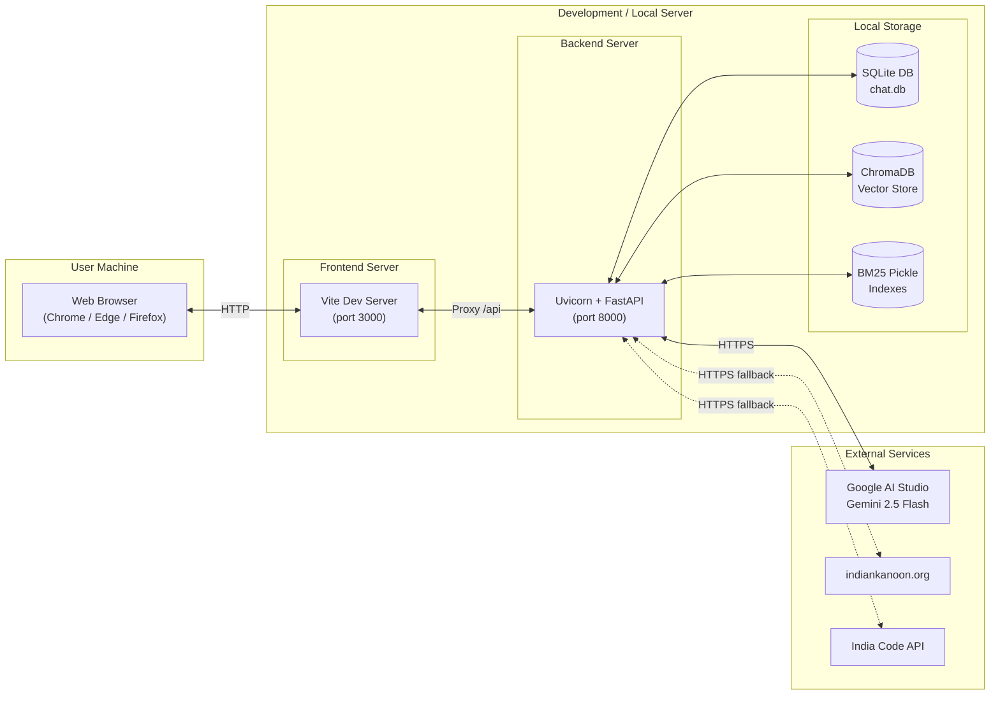

### 1.6 Component Diagram — Frontend Module Structure

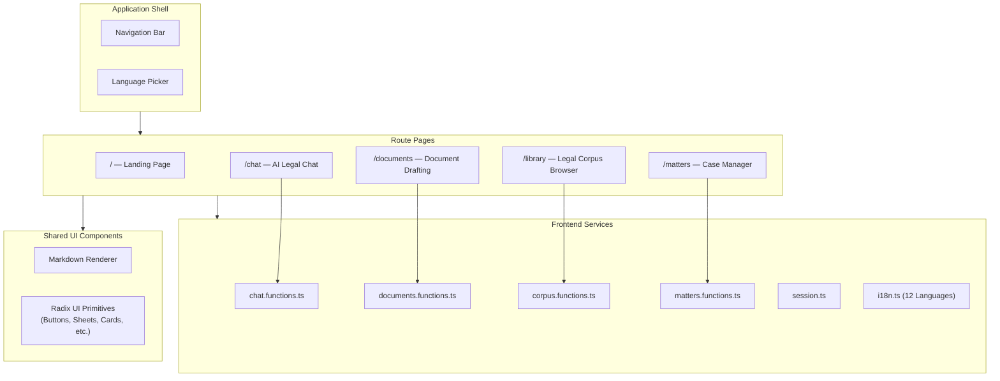

---

## 2. Data Collection

The strength of NyayaSahay lies in its massive, highly curated local semantic knowledge base, optimised for offline functionality and low-latency retrieval.

### 2.1 Dataset Overview

| Dataset | Size | Description |
|---------|------|-------------|
| Supreme Court Judgments | **33,016 judgments** | Decades of jurisprudence spanning landmark cases, precedent-setting verdicts, and appellate decisions |
| Constitution of India | Full text | All Articles, Schedules, and Amendments |
| Bharatiya Nyaya Sanhita (BNS) | Full text | Replaced Indian Penal Code (IPC) — new criminal law provisions |
| Bharatiya Nagarik Suraksha Sanhita (BNSS) | Full text | Replaced CrPC — new procedural framework |
| Central Acts | Comprehensive | Updated compendium of central legislation |

### 2.2 Ingestion Pipeline

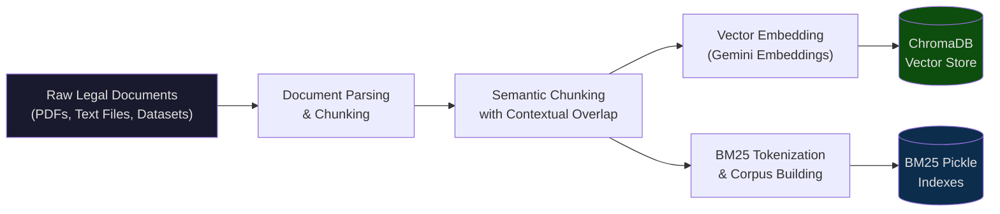

### 2.3 Ingestion Pipeline Steps

1. **Document Parsing & Chunking**  
   Raw legal texts (PDFs, JSONL datasets, plain text) are parsed automatically. Complex document structures — nested articles, section headings, provisos, and explanations — are flattened and segmented into logical semantic chunks with contextual overlap to ensure no legal provision is split across chunk boundaries.

2. **Vector Embedding (Dense Index)**  
   Each chunk is embedded using **Google Gemini Embeddings** (model: `text-embedding-004`, 768 dimensions). Embeddings are processed in optimised batch sizes for high-throughput sequential-to-pipelined indexing. Hardware-aware execution ensures stability on local machines.

3. **BM25 Indexing (Sparse Index)**  
   In parallel, chunks are tokenised into word-level corpora and indexed using the **BM25Okapi** algorithm. Pre-built BM25 indexes are serialised as Python pickle files for instant load on server startup. Each collection (Constitution, BNS, Central Acts, Supreme Court Judgments) gets its own BM25 index.

4. **Metadata Enrichment**  
   Every chunk is stored alongside rich metadata — Act name, section numbers, article references, judgment citations, year, and source file paths — enabling precise citation generation in AI responses.

5. **Storage Architecture**  
   - **ChromaDB**: Local vector database storing dense embeddings alongside document metadata. Supports cosine similarity search.
   - **BM25 Pickle Files**: Serialised sparse indexes loaded into memory at startup for sub-millisecond keyword retrieval.
   - **SQLite**: Lightweight relational database for chat threads, messages, and user session persistence.

### 2.4 Data Collection from External Sources (Fallback)

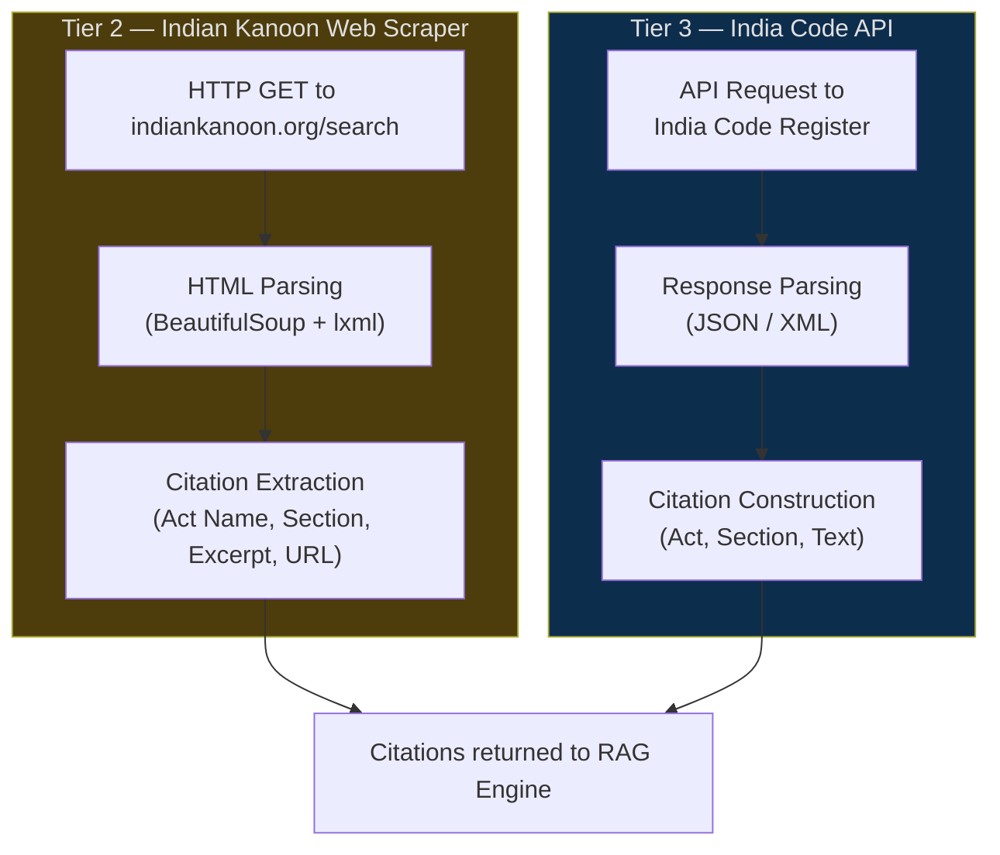

| Source | Type | Purpose | Trigger |
|--------|------|---------|---------|
| Indian Kanoon | Web Scraping (HTML) | Largest free Indian legal database — case law, statutes, and judgments | Local RAG confidence below threshold |
| India Code | Public API | Official central government register of all Indian Acts | No results from Indian Kanoon |

---

## 3. Implementation on User Interface

The frontend is built with **React 19**, **TanStack Start/Router**, and **TailwindCSS 4**, using **Radix UI** primitives for accessible, professional components. The design follows a **glassmorphism aesthetic** with a dark colour scheme.

### 3.1 Frontend Technology Stack

| Technology | Version | Purpose |
|------------|---------|---------|
| React | 19.2 | UI rendering framework |
| TanStack Start | 1.168.32 | Full-stack React framework with file-based routing |
| TanStack Router | 1.170.18 | Type-safe client-side routing |
| TanStack React Query | 5.x | Server state management and data caching |
| Vite | 8.1.5 | Build tool and dev server |
| TailwindCSS | 4.2.1 | Utility-first CSS framework |
| Radix UI | Latest | Headless, accessible component primitives |
| Lucide React | 0.575 | Icon library |
| Zod | 3.25 | Runtime type validation |
| Sonner | 2.0 | Toast notifications |
| TypeScript | 5.8 | Static type safety |

### 3.2 Application Page Map

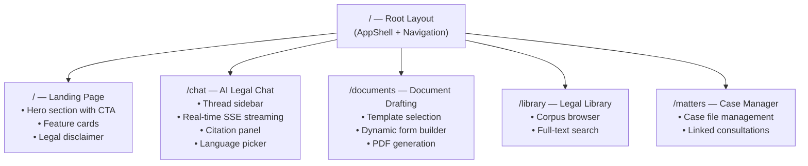

### 3.3 Chat Interface — Detailed UI Architecture

The chat page is the core interaction surface. It provides a multi-turn, streaming conversation experience grounded in legal citations.

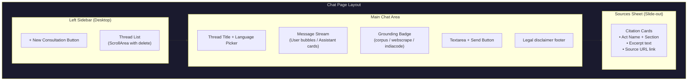

### 3.4 Key UI Features

1. **Real-Time Token Streaming (SSE)**
   - Messages are rendered token-by-token as they arrive from the backend via Server-Sent Events
   - A loading spinner with "Thinking…" text displays during the RAG retrieval phase
   - Automatic scroll-to-bottom keeps the latest content visible

2. **Citation Verification System**
   - Each AI response includes a grounding badge (`From indexed Acts`, `From legal websites`, `General guidance`)
   - Clicking "Sources (N)" opens a slide-out panel with detailed citation cards
   - Each citation shows: Act name, Section number, Excerpt text, and a link to the original source

3. **Conversation Management**
   - Thread sidebar with CRUD operations (Create, Read, Delete)
   - Auto-generated titles via LLM after the first exchange
   - Persistent sessions using browser-generated UUIDs stored in localStorage
   - Conversation history maintained in SQLite with up to 24 recent turns

4. **Multilingual Support (12 Languages)**
   - Built-in i18n system with translations for: English, Hindi, Bengali, Tamil, Telugu, Marathi, Gujarati, Kannada, Malayalam, Punjabi, Odia, and Urdu
   - Language picker accessible from the chat header
   - System prompts adapt dynamically to the selected language

5. **Responsive Design**
   - Thread sidebar collapses on mobile; a floating "New" button appears instead
   - Chat bubbles adapt max-width for readability
   - Full keyboard support (Enter to send, Shift+Enter for newline)

### 3.5 UI Data Flow — SSE Streaming

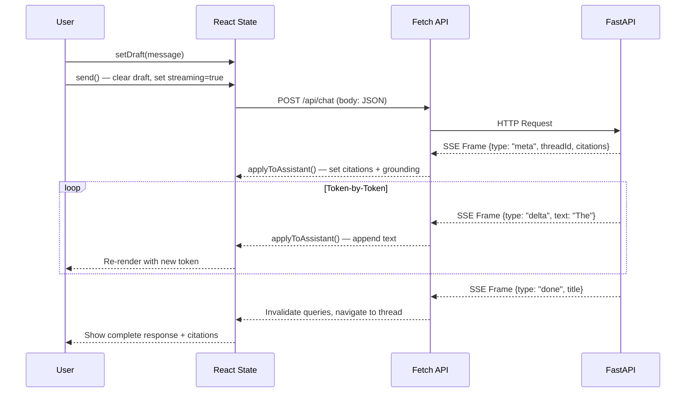

---

## 4. Code Implementation

NyayaSahay's codebase is organized into two main modules: a Python FastAPI backend and a TypeScript/React frontend. Below is a detailed breakdown of the core implementation.

### 4.1 Backend Architecture

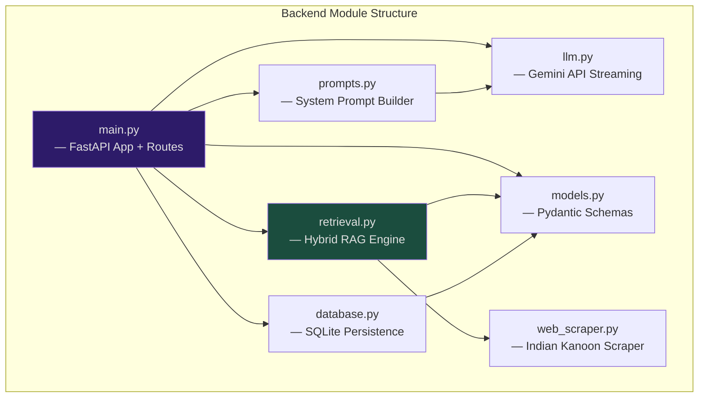

### 4.2 Backend Module Details

#### 4.2.1 `main.py` — FastAPI Gateway (222 lines)

The application entry point that defines all API endpoints and orchestrates the request lifecycle.

| Endpoint | Method | Description |
|----------|--------|-------------|
| `/api/chat` | POST | SSE streaming legal chat (RAG + LLM) |
| `/api/threads` | GET | List conversation threads for a session |
| `/api/threads/{id}` | GET | Get a thread with all messages |
| `/api/threads/{id}` | DELETE | Delete a conversation thread |
| `/api/health` | GET | Backend health check |

**Key Implementation Details:**
- CORS middleware allows all origins for development
- Chat endpoint returns `StreamingResponse` with `text/event-stream` media type
- SSE frames follow a structured JSON protocol with types: `meta`, `delta`, `done`, `error`
- Auto-generates conversation titles after first exchange using LLM

#### 4.2.2 `retrieval.py` — Hybrid RAG Engine (466 lines)

The core intelligence module implementing a dual-index search with confidence-based fallback.

**Key Functions:**

```
retrieve_context(question)        → Main entry point: orchestrates tiered retrieval
_search_chroma(question, n=8)     → Dense search across all ChromaDB collections
_search_bm25(question, n=8)       → Sparse keyword search across BM25 indexes
_rrf_fuse(dense, sparse, k=60)    → Reciprocal Rank Fusion merger
_get_gemini_embedding(text)       → Generate embeddings via Google API
_search_indiacode(question)       → India Code API fallback
_build_context(citations)         → Format citations into LLM-ready context
```

**Retrieval Strategy:**
1. Execute **dense search** (ChromaDB with Gemini embeddings) and **sparse search** (BM25Okapi) in parallel
2. Merge results using **Reciprocal Rank Fusion (RRF)** with parameter k=60
3. If top results exceed confidence threshold → return with `grounding="corpus"`
4. If below threshold → fall through to **web scraping** (Indian Kanoon)
5. If web scraping fails → fall through to **India Code API**
6. If all sources fail → return `grounding="none"` for general guidance

#### 4.2.3 `llm.py` — LLM Streaming Service (111 lines)

Handles communication with Google Gemini API for text generation.

- **Model**: Gemini 2.5 Flash (configurable via environment variable)
- **Streaming**: Uses `httpx.AsyncClient` with SSE streaming for real-time token delivery
- **Message Format Conversion**: Translates OpenAI-style messages (`user`, `assistant`, `system`) to Gemini's native format (`user`, `model`, `system_instruction`)
- **Configuration**: Temperature 0.7, max output tokens 4096

#### 4.2.4 `database.py` — SQLite Persistence (220 lines)

Manages chat thread and message persistence using raw SQLite with WAL mode for concurrent access.

**Schema:**

```sql
CREATE TABLE chat_threads (
    id TEXT PRIMARY KEY,
    session_id TEXT NOT NULL,
    title TEXT NOT NULL DEFAULT 'New consultation',
    language TEXT NOT NULL DEFAULT 'en',
    matter_id TEXT,
    created_at TEXT NOT NULL,
    updated_at TEXT NOT NULL
);

CREATE TABLE chat_messages (
    id TEXT PRIMARY KEY,
    thread_id TEXT NOT NULL REFERENCES chat_threads(id) ON DELETE CASCADE,
    role TEXT NOT NULL CHECK(role IN ('user', 'assistant')),
    content TEXT NOT NULL,
    citations TEXT NOT NULL DEFAULT '[]',
    grounding TEXT NOT NULL DEFAULT 'none',
    created_at TEXT NOT NULL
);
```

#### 4.2.5 `models.py` — Pydantic Schemas (50 lines)

Type-safe data validation models used across the backend:

- `ChatRequest` — Incoming chat message with session/thread context
- `Citation` — A single legal citation with act name, section, excerpt, origin, and score
- `RetrievalResult` — Bundle of citations + context string + grounding source type
- `ThreadSummary` — Lightweight thread listing (id, title, language, timestamp)
- `ChatTurn` — A single message in a conversation with role, content, and citations

#### 4.2.6 `prompts.py` — System Prompt Builder (124 lines)

Constructs dynamic, context-aware system prompts for the NyayaSahay persona.

**Prompt Adaptation by Grounding Source:**

| Grounding | Prompt Strategy |
|-----------|-----------------|
| `corpus` | Instructs LLM to use local passages as primary reference with bracketed citations |
| `webscrape` | Instructs LLM to acknowledge Indian Kanoon as source and share source URLs |
| `indiacode` | Instructs LLM to reference India Code provisions |
| `none` | Instructs LLM to provide general guidance with disclaimer and recommend legal aid |

The NyayaSahay persona is configured as both a general legal information resource and a personal legal advisor — analysing specific facts, identifying applicable laws, and suggesting practical next steps (forum, documents, timelines).

#### 4.2.7 `web_scraper.py` — Indian Kanoon Scraper (152 lines)

An asynchronous web scraper that queries `indiankanoon.org` as a fallback data source.

- Uses `httpx` for async HTTP requests with 12-second timeouts
- Parses HTML using `BeautifulSoup` with `lxml` parser
- Extracts up to 6 citations per query: Act name, section number, excerpt, and source URL
- Gracefully returns empty results on any error (network, parsing) to allow further fallback

### 4.3 Frontend Module Structure

| Module | Lines | Description |
|--------|-------|-------------|
| `routes/index.tsx` | 149 | Landing page with hero section, feature cards, and legal disclaimer |
| `routes/chat.tsx` | 473 | Full chat interface with thread management, SSE streaming, and citation panel |
| `routes/documents.tsx` | 16,674 bytes | Document drafting with template selection and dynamic forms |
| `routes/library.tsx` | 13,982 bytes | Legal corpus browser with full-text search |
| `routes/matters.tsx` | 8,900 bytes | Case file manager with linked consultations |
| `lib/chat.functions.ts` | 3,474 bytes | Backend API client for chat thread CRUD |
| `lib/i18n.ts` | 11,927 bytes | Internationalisation strings for 12 Indian languages |
| `lib/legal.ts` | 4,889 bytes | Legal type definitions and utilities |
| `components/markdown-text.tsx` | 3,584 bytes | Markdown renderer with citation link interception |

### 4.4 Key Dependencies

#### Backend (Python)

| Package | Version | Purpose |
|---------|---------|---------|
| FastAPI | 0.115.12 | Web framework for REST APIs |
| Uvicorn | 0.34.3 | ASGI server |
| ChromaDB | 0.6.3 | Vector database for dense embeddings |
| rank-bm25 | 0.2.2 | BM25Okapi sparse retrieval |
| httpx | 0.28.1 | Async HTTP client (for Gemini API + web scraping) |
| Pydantic | 2.11.3 | Data validation and serialisation |
| BeautifulSoup4 | 4.13.4 | HTML parsing for Indian Kanoon scraping |
| lxml | 5.4.0 | Fast XML/HTML parser backend |
| python-dotenv | 1.1.0 | Environment variable management |

#### Frontend (TypeScript)

| Package | Version | Purpose |
|---------|---------|---------|
| React | 19.2.0 | UI rendering |
| TanStack Router | 1.170.18 | File-based routing with type safety |
| TanStack React Query | 5.x | Server state management |
| TailwindCSS | 4.2.1 | Utility-first CSS |
| Radix UI | Latest | Accessible component primitives |
| Zod | 3.25 | Runtime schema validation |
| Vite | 8.1.5 | Build tool with HMR |

### 4.5 End-to-End Request Flow — Code Walkthrough

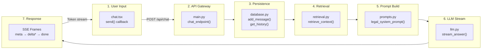

---

*This document was prepared for academic and development reference purposes for the NyayaSahay Indian Legal Assistance System project.*
